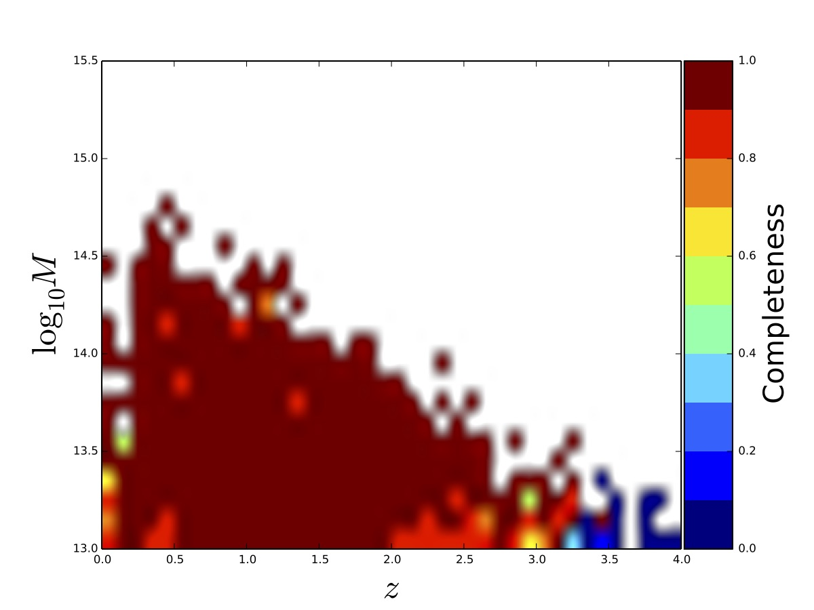

PYCYMATCH
==================

@author Samuel Farrens

Contents
------------
1. [Introduction](#intro_anchor)
2. [Dependenies](#depend_anchor)
3. [Execution](#exe_anchor)

Introduction
------------
Pycymatch (versions 4 & 5) is a cylindrical matching code for identifying
matches between a catalogue of simulated dark matter haloes populated with
galaxies and the results of a cluster detection algorithm run on said
catalogue. The code defines the "cylinder" as the R200 distance from the halo
centre and `2 x dz(1 + z)` (where dz is the expected photometric redshift error).
The code additionally requires that any potential matches be within the
boundaries defined by the members of the mock halo (*i.e.* the farthest extent in
RA and Dec of the members).

Version 4 of the code rank orders the mock haloes and the detections by Ngal
(*i.e.* the number of galaxy members) and enforces unique matches. This ensures
that a given halo is always matched to the largest available detection that
satisfies the matching criteria. (*Note:* This method was implemented for the
Euclid Cluster Finder Challenges (CFC) 1 and 2)

Version 5 of the code does not rank order the objects. Instead this code finds
all possible detections (*i.e.* those that satisfy the matching criteria). A
weighting is then assigned to each match to either find the best possible
unique match (providing identical results to V4) or to find the probability
distribution of all of the matches.

Dependencies
------------

The code requires the following Python packages:

* <a href="http://www.numpy.org/" target="_blank">Numpy</a>

* <a href="http://www.scipy.org/" target="_blank">SciPy</a>

* <a href="http://matplotlib.org/" target="_blank">Matplotlib</a>

Execution
------------

**Input Format**

The expected inputs for both versions of the code are two ASCII files:

1. The mock halo catalogue.
2. A catalogue of cluster detections.

*Mock Halo Catalogue Format:*

For the mock halo catalogue the codes expect to find the following properties
in the following order:

1. ID:`(A unique string of numbers and/or characters to identify the halo)`
2. Central Galaxy Flag: `(A boolean, i.e. 0 or 1)`
3. RA: `(The halo Right Ascension in degrees)`
4. Dec: `(The halo Declination in degrees)`
5. z: `(The halo redshift)`
6. Ngal: `(The number of galaxy members in the halo)`
7. Mass: `(Log10 of the halo mass)`
8. R200: `(R200 of the halo in arcminutes)`
9. Min RA: `(Minimum halo member RA)`
10. Max RA: `(Maximum halo member RA)`
11. Min Dec: `(Minimum halo member Dec)`
12. Max Dec: `(Maximum halo member Dec)`

*Cluster Detection Catalogue Format:*

For the detection catalogue the codes expect to find the following properties
in the following order:

1. ID:`(A unique string of numbers and/or characters to identify the cluster)`
2. RA: `(The cluster Right Ascension in degrees)`
3. Dec: `(The cluster Declination in degrees)`
4. z: `(The cluster redshift)`
5. Ngal: `(The number of galaxy members in the cluster)`
6. SNR: `(The signal-to-noise ratio of the cluster)`

**Outputs**

Both codes output the following plots:

* Completeness vs. mass and redshift.
* Completeness vs. Ngal (halo) and redshift.
* Purity vs. Ngal (detection) and redshift.

Additional version 4 outputs:

* SNR vs. mass and redshift.
* Spearman's rank order correlation coefficient vs. redshift.
* List of all mock haloes and corresponding detection matches.
* List of all detections and corresponding halo matches.

Additional version 5 outputs:

* Cluster mass observable (lambda) vs. mass in bins of redshift.
* Histograms of mass in bins of redshift.
* Histograms of lambda in bins of mass and redshift.
* Mass-observable matrices in bins of redshift.
* List of matched haloes and corresponding detections.

**Running the Codes**

The codes can be run as executables by changing the file permissions
and specifying the path to Python (this is first line of the
pycymatch_v4.py and pycymatch_v5.py files and the default is /usr/bin/python)
e.g.:

> \>\> chmod +x pycymatch_v5.py

Otherwise to run the code symply run Python e.g:

> \>\> python pycymatch_v5.py

Help and a list of arguments are provided with the `--help` option e.g:

> \>\> python pycymatch_v5.py --help

**Example**

To find matches with dz = 0.05 with version 4:

> \>\> python pycymatch_v4.py -c DETECTIONS_FILE -m MOCK_FILE -z 0.05

To find unique matches with version 5:

> \>\> python pycymatch_v5.py -i DETECTIONS_FILE MOCK_FILE -z 0.05 -u

To find non-unique matches with version 5:

> \>\> python pycymatch_v5.py -i DETECTIONS_FILE MOCK_FILE -z 0.05

**NOTE: A full list of code options will be added in the future.**
